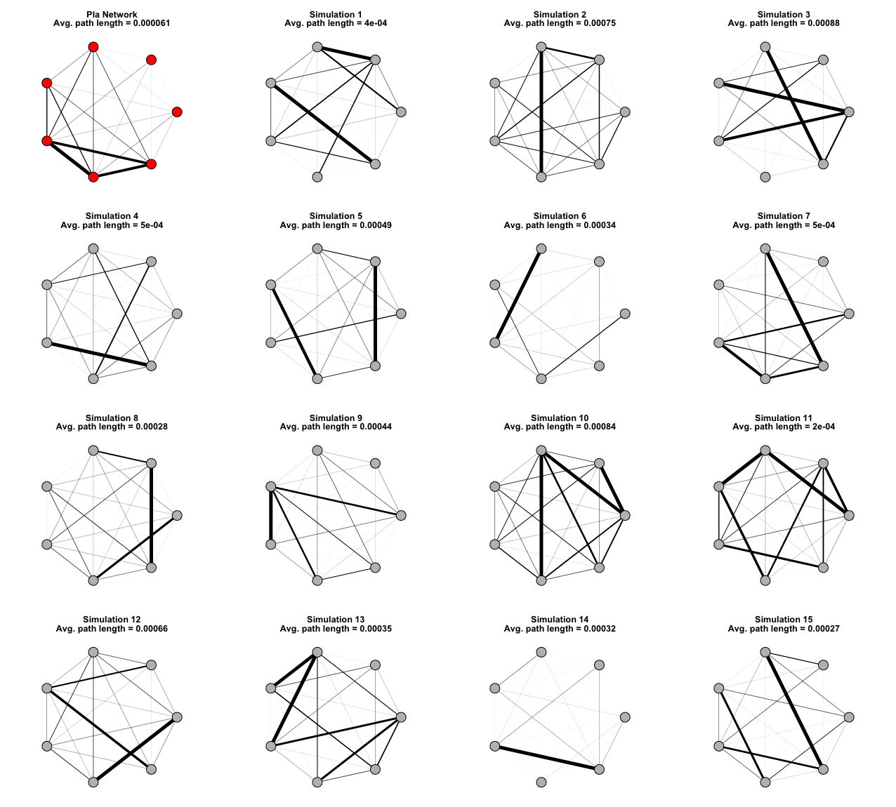

# The Network Structure of Social Play: Insights into Group Cohesion and Dynamics from Mantled Howler Monkeys (Alouatta palliata)

Asensio, N., Zandonà, E., Dunn, J.C. et al. The Network Structure of Social Play: Insights into Group Cohesion and Dynamics from Mantled Howler Monkeys (Alouatta palliata). Int J Primatol (2025). https://doi.org/10.1007/s10764-025-00522-1

**Fig. 1.** Observed PLA network structure alongside 15 randomly generated networks using
the Erdős-Rényi algorithm, preserving the same number of nodes and matching the observed
network's edge density. Edges are assigned random weights drawn from a log-normal
distribution of observed dyadic playtimes. The relative width of the edges represents the
duration of playtime interactions, with thicker edges indicating longer interactions. Each
simulated network is displayed with its average path length.
